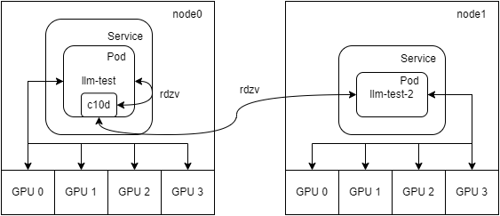

From https://github.com/facebookresearch/llama-recipes/

specifically from commit 43771602c9d7808c888eb5995ccce4bc8beafb1f as of 1/12/2023

# Model

Download official Llama2 from Meta, specifically the 7b and 13b variants.

Use https://github.com/huggingface/transformers/blob/main/src/transformers/models/llama/convert_llama_weights_to_hf.py to convert to hf format

Output folder at `model-7b` and `model-13b`

# Dataset

Download `samsun` dataset to `dataset` folder

```
from datasets import load_dataset

for split in ['train', 'validation']:
    load_dataset("samsum", split=split).to_json(f'../dataset/samsun_{split}.jsonl')
````
# Runs logging

## Single V100 (32GB) GPU

LoRA PEFT of quantized 7b (`load_in_4bit=True`) in half precision works as per local

```
python3 finetuning.py \
    --split_slice 1% \
    --use_peft \
    --quantization True \
    --use_fp16 True
```

LoRA PEFT of 7b in full/half precision results in CUDA OOM

```
python3 finetuning.py \
    --split_slice 1% \
    --use_peft \
    --quantization False \
    --use_fp16 False
```

```
python3 finetuning.py \
    --split_slice 1% \
    --use_peft \
    --quantization False \
    --use_fp16 True
```

Full finetuning of 7b in full/half precision results in CUDA OOM

```
python3 finetuning.py \
    --split_slice 1% \
    --quantization False \
    --use_fp16 False
```
```
python3 finetuning.py \
    --split_slice 1% \
    --quantization False \
    --use_fp16 True
```

Full finetuning of quantized 7b (`load_in_4bit=True`) in full precision works, but training loss does not decrease

```
python3 finetuning.py \
    --split_slice 1% \
    --quantization True \
    --use_fp16 False 
```

Full finetuning of quantized 7b (`load_in_4bit=True`) in half precision results in

`AssertionError: No inf checks were recorded for this optimizer.`

```
python3 finetuning.py \
    --split_slice 1% \
    --quantization True \
    --use_fp16 True 
```

## Single node multi V100 (32GB) GPU

FSDP is used to do sharding of model (and data) across gpus.

~~There was a weird issue of the device not setting properly for FSDP, resulting in `Inconsistent compute_device and device_id`, possibly fix it with `export CUDA_VISIBLE_DEVICES=0,1,2,3`.~~ It is due to `quantization` set to `True`, resulting in `device_map` to be `auto`, which maps the model to device 0 and is possibly a bug in the code. Do not use quantization when using FSDP, it is not supported anyway.

Full finetuning of 7b in half precision results in CUDA OOM

```
torchrun \
    --nnodes 1 \
    --nproc_per_node 4 \
    finetuning.py \
    --split_slice 1% \
    --enable_fsdp \
    --quantization False \
    --use_fp16 True \
```

LoRA PEFT of 7b in half precision works! Note that quantization is not supported for FSDP.

eval_ppl and eval_loss decreases similarly to the single gpu case as well.

```
torchrun \
    --nnodes 1 \
    --nproc_per_node 4 \
    finetuning.py \
    --split_slice 1% \
    --enable_fsdp \
    --use_peft \
    --quantization False \
    --use_fp16 True \
```

For FSDP, use 

- `quantization=False` as quantization is not supported for FSDP
- ~~`use_fp16=False` in other words full precision to reduce memory usage~~ Proven wrong

However, 

Full finetuning of 7b in full precision results in CUDA OOM, even decreasing samples to 10 `split_slice=10` results in CUDA OOM

Model is successfully loaded across different GPUs (~10GB used per GPU), but when training starts CUDA OOM occurs, possibly due to the optimizer memory usage.

```
torchrun \
    --nnodes 1 \
    --nproc_per_node 4 \
    finetuning.py \
    --split_slice 1% \
    --enable_fsdp \
    --quantization False \
    --use_fp16 False \
```

Looking into FSDP parameters,

- Sharding strategy by default is `FULL_SHARD` which shards all model parameters, optimizer and gradient states, which uses the least GPU memory
- CPU offload (by default false) can be used to offload parameters to CPU when not involved in computation, saving GPU memory at the cost of CPU memory and speed

Full finetuning of 7b in full precision with FSDP CPU_OFFLOAD works but results in OOM (killed by OS)

- CPU Utilization: From logs, CPU total peak memory consumed is 40GB/63GB. From Grafana, ~8 cores used
- GPU Utilization: From logs, GPU total peak memory is 17GB/18GB. From `nvidia-smi`, ~20GB used per GPU

```
torchrun \
    --nnodes 1 \
    --nproc_per_node 4 \
    finetuning.py \
    --split_slice 1% \
    --enable_fsdp \
    --quantization False \
    --use_fp16 False \
    --fsdp_config.fsdp_cpu_offload True \
```

Trains successfully with 10 samples.

```
torchrun \
    --nnodes 1 \
    --nproc_per_node 4 \
    finetuning.py \
    --split_slice 10 \
    --enable_fsdp \
    --quantization False \
    --use_fp16 False \
    --fsdp_config.fsdp_cpu_offload True \
```

After switching to SGD which uses less GPU Memory than AdamW,

Full finetuning of 7b in full precision works, but there are CUDA Malloc retries

- CPU Utilization: From logs, CPU total peak memory consumed is 4GB. From Grafana, ~8 cores used
- GPU Utilization: From logs, GPU total peak memory is 29GB. From `nvidia-smi`, ~30GB used per GPU, which fluctuates between 26-32GB (limit) possibly due to the mallocs
- CUDA Malloc retries ~32 per epoch

```
torchrun \
    --nnodes 1 \
    --nproc_per_node 4 \
    finetuning.py \
    --split_slice 1% \
    --enable_fsdp \
    --quantization False \
    --use_fp16 False \
    --fsdp_config.optimizer SGD \
```

Full finetuning of 7b in half precision works with no issues!

- CPU Utilization: From logs, CPU total peak memory consumed is 4GB. From Grafana, ~8 cores used
- GPU Utilization: From logs, GPU total peak memory is 25GB. From `nvidia-smi`, ~28GB used per GPU

```
torchrun \
    --nnodes 1 \
    --nproc_per_node 4 \
    finetuning.py \
    --split_slice 1% \
    --enable_fsdp \
    --quantization False \
    --use_fp16 True \
    --fsdp_config.optimizer SGD \
```

Of course, the full dataset can be used to train

```
torchrun \
    --nnodes 1 \
    --nproc_per_node 4 \
    finetuning.py \
    --enable_fsdp \
    --quantization False \
    --use_fp16 True \
    --fsdp_config.optimizer SGD \
```

For 13b, it is not possible to train using 4x32GB, however, we can load the model to see FSDP GPU utilization.

For any `n`b model, it will require `4n`GB VRAM if loaded in full precision using a single GPU.

For ONLY loading of model in full precision:
- 7b:
  - 1 GPU: 28GB
  - 4 GPUs: ~40GB (10GB per device)
- 13b:
  - 1 GPU: 52GB
  - 4 GPUs: ~80GB (20GB per device)

When only the `model_name=model-13b` was specified, the process is killed due to OOM, as all 4 processes will attempt to load 
the 13b model into RAM (13 * 4 * 4GB).

```
torchrun \
    --nnodes 1 \
    --nproc_per_node 4 \
    finetuning.py \
    --enable_fsdp \
    --quantization False \
    --use_fp16 False \
    --fsdp_config.optimizer SGD \
    --model_name model-13b \
```

`low_cpu_fsdp=True` needs to be specified as well, so that only the 0 rank process will load the model into RAM, and 
subsequently GPU, while the other processes will directly read from GPU. Note that from `nvidia-smi`, when the model 
is loaded, the utilization of GPU 0 is ~20GB (correct), and that of GPUs 1, 2, 3 are ~32GB (max) due to the preallocation,
which will be freed up when training starts.

```
torchrun \
    --nnodes 1 \
    --nproc_per_node 4 \
    finetuning.py \
    --enable_fsdp \
    --quantization False \
    --use_fp16 False \
    --fsdp_config.optimizer SGD \
    --model_name model-13b \
    --low_cpu_fsdp True \
```

## Multi node multi V100 (32GB) GPU

To perform multi-node training, pytorch uses a mechanism for distributed synchronization called [rendezvous](https://pytorch.org/docs/stable/elastic/rendezvous.html).
The k8s cluster setup is 2 nodes, each with 4 V100 GPUs. A pod will be created in each of the nodes, and they must be able
to reach a common rendezvous endpoint.

Initially etcd-v2 was used (refer to this [commit](https://github.com/bobcchen/peft-explore/commit/5c3f210fec9b90f82824b05329e48a912dffc960)) as the rdzv backend, 
referencing this [comment](https://github.com/pytorch/pytorch/issues/65992#issuecomment-954382747). The rdzv endpoint is
the client endpoint of the etcd server `etcd-server.llm-test.svc.cluster.local:2379`. However, there were still issues resolving
the IP addresses of the pods, as indicated by the error `(<pod name>, <random port>) cannot be resolved`. A workaround is to
add the explicit IP address of `<pod name>` to `/etc/hosts` of the pod displaying that error. This was not clean enough
as the pod IP is not known before it is created.

Instead, we can use a headless k8s service to resolve the IP address of the pods. Note that the service url needs to be
passed explicitly using the `--local_addr` flag to `torchrun`. In addition, to remove the external dependency of etcd, 
we can use c10d as the rdzv backend, as recommended by pytorch. Refer to deployment.yaml and deployment2.yaml. After applying,
we get:



Note that rdzv goes through the respective services for both pods, even for llm-test.

With the deployments in place, full finetuning of 7b can be performed across the 2 nodes, utilizing 2 GPUs from each node.

In the first pod (llm-test):

```
torchrun \
    --nnodes 2 \
    --nproc_per_node 2 \
    --rdzv-id=123 \
    --rdzv-endpoint=llm-test.llm-test.svc.cluster.local:29500 \
    --rdzv-backend=c10d \
    --local_addr llm-test.llm-test.svc.cluster.local \
    finetuning.py \
    --enable_fsdp \
    --quantization False \
    --use_fp16 True \
    --fsdp_config.optimizer SGD \
    --split_slice 1% \
```

In the second pod (llm-test-2):

```
torchrun \
    --nnodes 2 \
    --nproc_per_node 2 \
    --rdzv-id=123 \
    --rdzv-endpoint=llm-test.llm-test.svc.cluster.local:29500 \
    --rdzv-backend=c10d \
    --local_addr llm-test-2.llm-test.svc.cluster.local \
    finetuning.py \
    --enable_fsdp \
    --quantization False \
    --use_fp16 True \
    --fsdp_config.optimizer SGD \
    --split_slice 1% \
```

GPU utilization (peak ~25GB per device) is the same as the 1 node 4 GPU setup. Training and validation perplexity/loss
are the same as the 1 node 4 GPU setup as well. However, training time was much longer (average time per epoch of 1487s vs 27s for only 100+ samples),
due to the rdvz process done over network.

Despite the slow training, it is now possible to do full finetuning of the 13b, using minimally 3 GPUs from each node.

```
torchrun \
    --nnodes 2 \
    --nproc_per_node 3 \
    --rdzv-id=234 \
    --rdzv-endpoint=llm-test.llm-test.svc.cluster.local:29500 \
    --rdzv-backend=c10d \
    --local_addr llm-test.llm-test.svc.cluster.local \
    finetuning.py \
    --enable_fsdp \
    --quantization False \
    --use_fp16 True \
    --fsdp_config.optimizer SGD \
    --split_slice 1% \
    --model_name model-13b \
```

```
torchrun \
    --nnodes 2 \
    --nproc_per_node 3 \
    --rdzv-id=234 \
    --rdzv-endpoint=llm-test.llm-test.svc.cluster.local:29500 \
    --rdzv-backend=c10d \
    --local_addr llm-test-2.llm-test.svc.cluster.local \
    finetuning.py \
    --enable_fsdp \
    --quantization False \
    --use_fp16 True \
    --fsdp_config.optimizer SGD \
    --split_slice 1% \
    --model_name model-13b \
```

Training successfully completes with high GPU utilization (peak ~30-32GB per device, with cuda mallocs) and an average 
time per epoch of 2119s. Surprisingly there was no OOM caused by the 3 processes loading the model into RAM per node.

Based on the training speeds, it might be faster to make do with a single node setup (multi gpu with offload to cpu) to train,
due to high cost of internode synchronization. 
